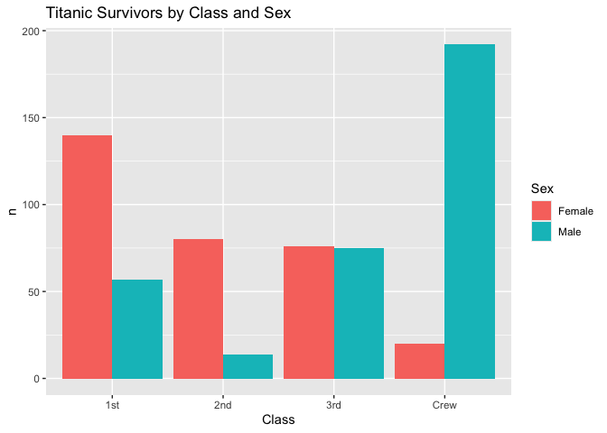
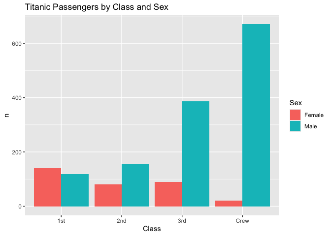
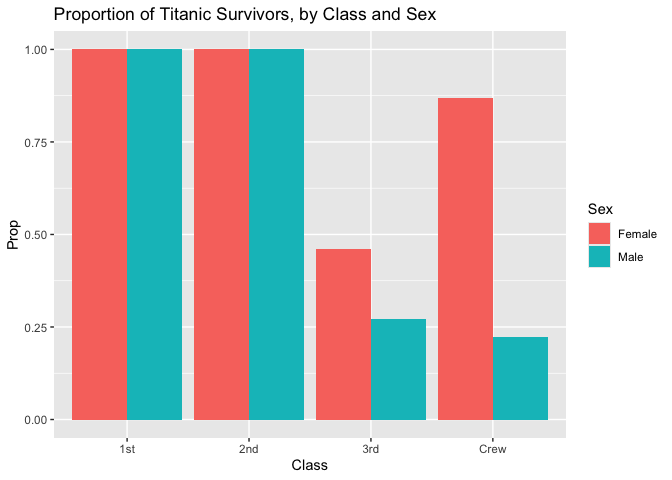

RMS Titanic
================
Sam Mendelson
2025-02-05

- [Grading Rubric](#grading-rubric)
  - [Individual](#individual)
  - [Submission](#submission)
- [First Look](#first-look)
  - [**q1** Perform a glimpse of `df_titanic`. What variables are in
    this
    dataset?](#q1-perform-a-glimpse-of-df_titanic-what-variables-are-in-this-dataset)
  - [**q2** Skim the Wikipedia article on the RMS Titanic, and look for
    a total count of souls aboard. Compare against the total computed
    below. Are there any differences? Are those differences large or
    small? What might account for those
    differences?](#q2-skim-the-wikipedia-article-on-the-rms-titanic-and-look-for-a-total-count-of-souls-aboard-compare-against-the-total-computed-below-are-there-any-differences-are-those-differences-large-or-small-what-might-account-for-those-differences)
  - [**q3** Create a plot showing the count of persons who *did*
    survive, along with aesthetics for `Class` and `Sex`. Document your
    observations
    below.](#q3-create-a-plot-showing-the-count-of-persons-who-did-survive-along-with-aesthetics-for-class-and-sex-document-your-observations-below)
- [Deeper Look](#deeper-look)
  - [**q4** Replicate your visual from q3, but display `Prop` in place
    of `n`. Document your observations, and note any new/different
    observations you make in comparison with q3. Is there anything
    *fishy* in your
    plot?](#q4-replicate-your-visual-from-q3-but-display-prop-in-place-of-n-document-your-observations-and-note-any-newdifferent-observations-you-make-in-comparison-with-q3-is-there-anything-fishy-in-your-plot)
  - [**q5** Create a plot showing the group-proportion of occupants who
    *did* survive, along with aesthetics for `Class`, `Sex`, *and*
    `Age`. Document your observations
    below.](#q5-create-a-plot-showing-the-group-proportion-of-occupants-who-did-survive-along-with-aesthetics-for-class-sex-and-age-document-your-observations-below)
- [Notes](#notes)

*Purpose*: Most datasets have at least a few variables. Part of our task
in analyzing a dataset is to understand trends as they vary across these
different variables. Unless we’re careful and thorough, we can easily
miss these patterns. In this challenge you’ll analyze a dataset with a
small number of categorical variables and try to find differences among
the groups.

*Reading*: (Optional) [Wikipedia
article](https://en.wikipedia.org/wiki/RMS_Titanic) on the RMS Titanic.

<!-- include-rubric -->

# Grading Rubric

<!-- -------------------------------------------------- -->

Unlike exercises, **challenges will be graded**. The following rubrics
define how you will be graded, both on an individual and team basis.

## Individual

<!-- ------------------------- -->

| Category | Needs Improvement | Satisfactory |
|----|----|----|
| Effort | Some task **q**’s left unattempted | All task **q**’s attempted |
| Observed | Did not document observations, or observations incorrect | Documented correct observations based on analysis |
| Supported | Some observations not clearly supported by analysis | All observations clearly supported by analysis (table, graph, etc.) |
| Assessed | Observations include claims not supported by the data, or reflect a level of certainty not warranted by the data | Observations are appropriately qualified by the quality & relevance of the data and (in)conclusiveness of the support |
| Specified | Uses the phrase “more data are necessary” without clarification | Any statement that “more data are necessary” specifies which *specific* data are needed to answer what *specific* question |
| Code Styled | Violations of the [style guide](https://style.tidyverse.org/) hinder readability | Code sufficiently close to the [style guide](https://style.tidyverse.org/) |

## Submission

<!-- ------------------------- -->

Make sure to commit both the challenge report (`report.md` file) and
supporting files (`report_files/` folder) when you are done! Then submit
a link to Canvas. **Your Challenge submission is not complete without
all files uploaded to GitHub.**

``` r
library(tidyverse)
```

    ## ── Attaching core tidyverse packages ──────────────────────── tidyverse 2.0.0 ──
    ## ✔ dplyr     1.1.4     ✔ readr     2.1.5
    ## ✔ forcats   1.0.0     ✔ stringr   1.5.1
    ## ✔ ggplot2   3.5.1     ✔ tibble    3.2.1
    ## ✔ lubridate 1.9.4     ✔ tidyr     1.3.1
    ## ✔ purrr     1.0.2     
    ## ── Conflicts ────────────────────────────────────────── tidyverse_conflicts() ──
    ## ✖ dplyr::filter() masks stats::filter()
    ## ✖ dplyr::lag()    masks stats::lag()
    ## ℹ Use the conflicted package (<http://conflicted.r-lib.org/>) to force all conflicts to become errors

``` r
df_titanic <- as_tibble(Titanic)
```

*Background*: The RMS Titanic sank on its maiden voyage in 1912; about
67% of its passengers died.

# First Look

<!-- -------------------------------------------------- -->

### **q1** Perform a glimpse of `df_titanic`. What variables are in this dataset?

``` r
## TASK: Perform a `glimpse` of df_titanic
glimpse(df_titanic)
```

    ## Rows: 32
    ## Columns: 5
    ## $ Class    <chr> "1st", "2nd", "3rd", "Crew", "1st", "2nd", "3rd", "Crew", "1s…
    ## $ Sex      <chr> "Male", "Male", "Male", "Male", "Female", "Female", "Female",…
    ## $ Age      <chr> "Child", "Child", "Child", "Child", "Child", "Child", "Child"…
    ## $ Survived <chr> "No", "No", "No", "No", "No", "No", "No", "No", "No", "No", "…
    ## $ n        <dbl> 0, 0, 35, 0, 0, 0, 17, 0, 118, 154, 387, 670, 4, 13, 89, 3, 5…

**Observations**:

- Class
- Sex
- Age
- Survived
- n

### **q2** Skim the [Wikipedia article](https://en.wikipedia.org/wiki/RMS_Titanic) on the RMS Titanic, and look for a total count of souls aboard. Compare against the total computed below. Are there any differences? Are those differences large or small? What might account for those differences?

``` r
## NOTE: No need to edit! We'll cover how to
## do this calculation in a later exercise.
df_titanic %>% summarize(total = sum(n))
```

    ## # A tibble: 1 × 1
    ##   total
    ##   <dbl>
    ## 1  2201

**Observations**:

- Are there any differences?
  - There is a difference of 1 person: Wikipedia says that there were
    approximately [1,317 passengers
    onboard](https://en.wikipedia.org/wiki/Titanic#Passengers) and [885
    crew](https://en.wikipedia.org/wiki/Titanic#Crew), for a total of
    2,202 souls.
  - Wikipedia may use the word “approximately” for a few reasons, some
    of which could have included:
    - Passenger records may have gotten lost or damaged
    - Some passengers may have been stowaways or were illegally on
      *Titanic*
    - The White Star Line may have had reasons to falsify records
- If yes, what might account for those differences?
  - Under both Crew and Passengers (in the Maiden Voyage section)
    Wikipedia uses the word “approximately” for the counts.
  - Passenger counts at the time varied between sources, too.

### **q3** Create a plot showing the count of persons who *did* survive, along with aesthetics for `Class` and `Sex`. Document your observations below.

*Note*: There are many ways to do this.

``` r
## TASK: Visualize counts against `Class` and `Sex`
survivors <- df_titanic %>% filter(Survived == "Yes")

survivors %>%
  ggplot(aes(x = Class, y = n)) +
  geom_col(aes(fill = Sex), position = "dodge") +
  ggtitle("Titanic Survivors by Class and Sex")
```

<!-- -->

**Observations**:

- It’s clear that women were first in line (or had a higher priority)
  for lifeboats, as far more women survived than men in all classes.
  - We know that there were not *just more women onboard* because if we
    look at the second class, for example, there were many more men than
    women however far more women survived than men (see plot below)

``` r
df_titanic %>%
  ggplot(aes(x = Class, y = n)) +
  geom_col(aes(fill = Sex), position = "dodge") +
  ggtitle("Titanic Passengers by Class and Sex")
```

<!-- -->

- The total number of survivors is highest in first class, followed by
  third class, then second class.
- Very few of the female crew survived. It is possible that this is due
  to the crew being made up of mostly men.
- The number of survivors in third class is higher than in second class,
  which is surprising given the common perception that third class
  passengers were the last to be saved.

# Deeper Look

<!-- -------------------------------------------------- -->

Raw counts give us a sense of totals, but they are not as useful for
understanding differences between groups. This is because the
differences we see in counts could be due to either the relative size of
the group OR differences in outcomes for those groups. To make
comparisons between groups, we should also consider *proportions*.\[1\]

The following code computes proportions within each `Class, Sex, Age`
group.

``` r
## NOTE: No need to edit! We'll cover how to
## do this calculation in a later exercise.
df_prop <-
  df_titanic %>%
  group_by(Class, Sex, Age) %>%
  mutate(
    Total = sum(n),
    Prop = n / Total
  ) %>%
  ungroup()
df_prop
```

    ## # A tibble: 32 × 7
    ##    Class Sex    Age   Survived     n Total    Prop
    ##    <chr> <chr>  <chr> <chr>    <dbl> <dbl>   <dbl>
    ##  1 1st   Male   Child No           0     5   0    
    ##  2 2nd   Male   Child No           0    11   0    
    ##  3 3rd   Male   Child No          35    48   0.729
    ##  4 Crew  Male   Child No           0     0 NaN    
    ##  5 1st   Female Child No           0     1   0    
    ##  6 2nd   Female Child No           0    13   0    
    ##  7 3rd   Female Child No          17    31   0.548
    ##  8 Crew  Female Child No           0     0 NaN    
    ##  9 1st   Male   Adult No         118   175   0.674
    ## 10 2nd   Male   Adult No         154   168   0.917
    ## # ℹ 22 more rows

### **q4** Replicate your visual from q3, but display `Prop` in place of `n`. Document your observations, and note any new/different observations you make in comparison with q3. Is there anything *fishy* in your plot?

``` r
df_prop %>%
  filter(Survived == "Yes") %>%
    ggplot(aes(x = Class, y = Prop, fill = Sex)) +
    geom_col(position = "dodge") +
    ggtitle("Proportion of Titanic Survivors, by Class and Sex")
```

    ## Warning: Removed 2 rows containing missing values or values outside the scale range
    ## (`geom_col()`).

<!-- -->

**Observations**:

- The plot shows that equal proportions of 1st and 2nd class men and
  women survived, which is incongruent with the historical record where
  women and children were loaded into lifeboats first.
- The proportion of female crew members who survived is higher than the
  proportion of 3rd class women who survived.
- Is there anything *fishy* going on in your plot?
  - One clear sign that something fishy is going on is that this chart
    appears to show that (at least in 1st and 2nd class), an equal
    proportion of men and women survived. However, we know this is
    untrue from historical records and our first chart.

### **q5** Create a plot showing the group-proportion of occupants who *did* survive, along with aesthetics for `Class`, `Sex`, *and* `Age`. Document your observations below.

*Hint*: Don’t forget that you can use `facet_grid` to help consider
additional variables!

``` r
df_prop %>%
  filter(Survived == "Yes") %>%
    ggplot(aes(x = Class, y = Prop, Age)) +
    facet_grid(~Age) +
    geom_col(aes(fill = Sex), position = "dodge")
```

    ## Warning: Removed 2 rows containing missing values or values outside the scale range
    ## (`geom_col()`).

<!-- -->

**Observations**:

- By splitting the chart by age, we see a plot that matches the
  historical record: women and children were loaded into lifeboats
  first.

- The proportion of survivors is highest in first class, followed by
  third class, then second class.

- It appears to show that 100% of children in 1st and 2nd class survived
  (which is not true), so there may be some data quality issues.

  Addressing Lily’s comment– sorry, but your statement: “If you look at
  the contents of the original dataset and look at the rows for 1st/2nd
  class children, it does show that all of these children survived.” is
  not accurate. See below:

``` r
df_titanic %>% filter(Class %in% c("1st", "2nd") & Survived == "No" & Age == "Child")
```

    ## # A tibble: 4 × 5
    ##   Class Sex    Age   Survived     n
    ##   <chr> <chr>  <chr> <chr>    <dbl>
    ## 1 1st   Male   Child No           0
    ## 2 2nd   Male   Child No           0
    ## 3 1st   Female Child No           0
    ## 4 2nd   Female Child No           0

- If you saw something *fishy* in q4 above, use your new plot to explain
  the fishy-ness.
  - Now, we see that tons and tons of men and women that survived in 1st
    and 2nd class were children, which were offloaded first (with adult
    women).
  - Since a much smaller percentage of 3rd class women survived, it’s
    likely that they were carrying the 3rd class children, therefore the
    proportion of 3rd class children who survived is lower (which this
    graph supports).

# Notes

<!-- -------------------------------------------------- -->

\[1\] This is basically the same idea as [Dimensional
Analysis](https://en.wikipedia.org/wiki/Dimensional_analysis); computing
proportions is akin to non-dimensionalizing a quantity.
