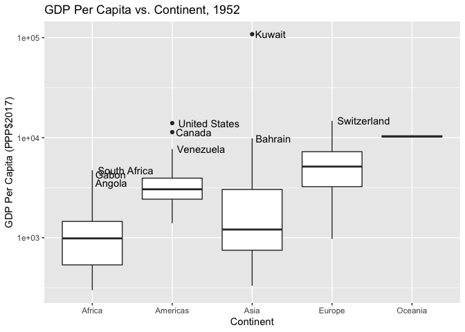
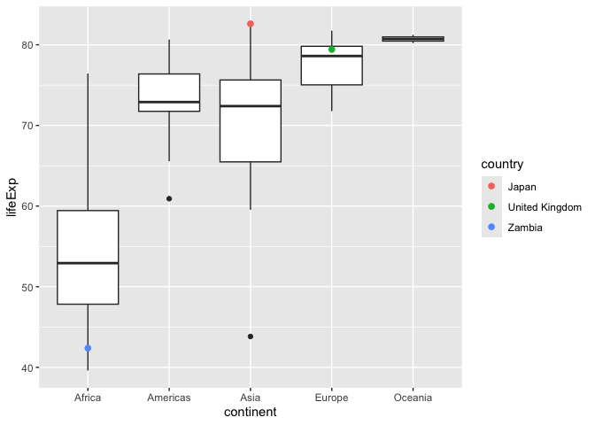
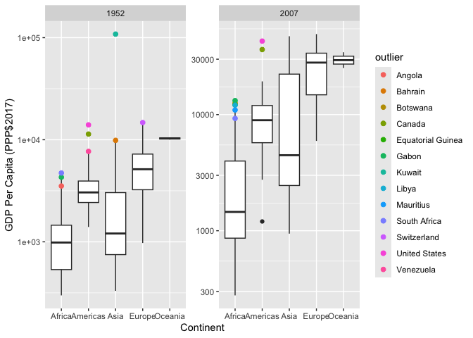
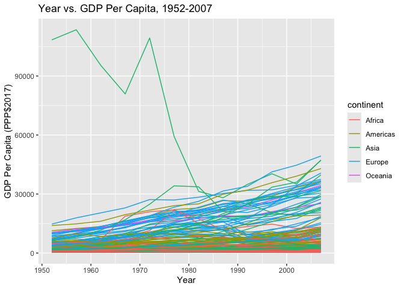
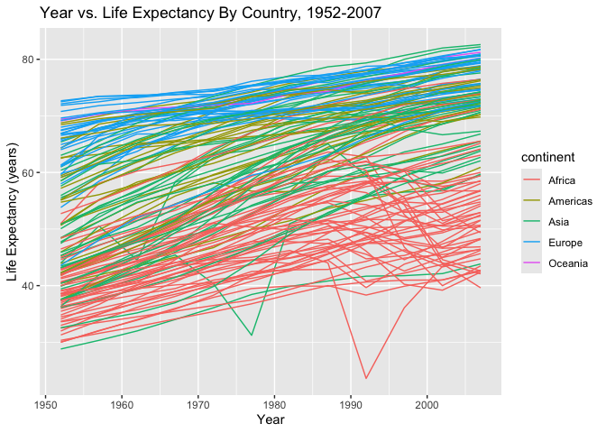
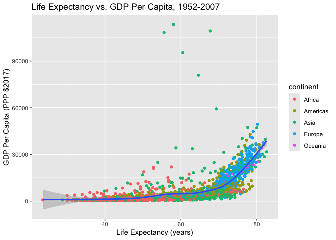

Gapminder
================
Sam Mendelson
2025-03-02

- [Grading Rubric](#grading-rubric)
  - [Individual](#individual)
  - [Submission](#submission)
- [Guided EDA](#guided-eda)
  - [**q0** Perform your “first checks” on the dataset. What variables
    are in this
    dataset?](#q0-perform-your-first-checks-on-the-dataset-what-variables-are-in-this-dataset)
  - [**q1** Determine the most and least recent years in the `gapminder`
    dataset.](#q1-determine-the-most-and-least-recent-years-in-the-gapminder-dataset)
  - [**q2** Filter on years matching `year_min`, and make a plot of the
    GDP per capita against continent. Choose an appropriate `geom_` to
    visualize the data. What observations can you
    make?](#q2-filter-on-years-matching-year_min-and-make-a-plot-of-the-gdp-per-capita-against-continent-choose-an-appropriate-geom_-to-visualize-the-data-what-observations-can-you-make)
  - [**q3** You should have found *at least* three outliers in q2 (but
    possibly many more!). Identify those outliers (figure out which
    countries they
    are).](#q3-you-should-have-found-at-least-three-outliers-in-q2-but-possibly-many-more-identify-those-outliers-figure-out-which-countries-they-are)
  - [**q4** Create a plot similar to yours from q2 studying both
    `year_min` and `year_max`. Find a way to highlight the outliers from
    q3 on your plot *in a way that lets you identify which country is
    which*. Compare the patterns between `year_min` and
    `year_max`.](#q4-create-a-plot-similar-to-yours-from-q2-studying-both-year_min-and-year_max-find-a-way-to-highlight-the-outliers-from-q3-on-your-plot-in-a-way-that-lets-you-identify-which-country-is-which-compare-the-patterns-between-year_min-and-year_max)
- [Your Own EDA](#your-own-eda)
  - [**q5** Create *at least* three new figures below. With each figure,
    try to pose new questions about the
    data.](#q5-create-at-least-three-new-figures-below-with-each-figure-try-to-pose-new-questions-about-the-data)

*Purpose*: Learning to do EDA well takes practice! In this challenge
you’ll further practice EDA by first completing a guided exploration,
then by conducting your own investigation. This challenge will also give
you a chance to use the wide variety of visual tools we’ve been
learning.

<!-- include-rubric -->

# Grading Rubric

<!-- -------------------------------------------------- -->

Unlike exercises, **challenges will be graded**. The following rubrics
define how you will be graded, both on an individual and team basis.

## Individual

<!-- ------------------------- -->

| Category | Needs Improvement | Satisfactory |
|----|----|----|
| Effort | Some task **q**’s left unattempted | All task **q**’s attempted |
| Observed | Did not document observations, or observations incorrect | Documented correct observations based on analysis |
| Supported | Some observations not clearly supported by analysis | All observations clearly supported by analysis (table, graph, etc.) |
| Assessed | Observations include claims not supported by the data, or reflect a level of certainty not warranted by the data | Observations are appropriately qualified by the quality & relevance of the data and (in)conclusiveness of the support |
| Specified | Uses the phrase “more data are necessary” without clarification | Any statement that “more data are necessary” specifies which *specific* data are needed to answer what *specific* question |
| Code Styled | Violations of the [style guide](https://style.tidyverse.org/) hinder readability | Code sufficiently close to the [style guide](https://style.tidyverse.org/) |

## Submission

<!-- ------------------------- -->

Make sure to commit both the challenge report (`report.md` file) and
supporting files (`report_files/` folder) when you are done! Then submit
a link to Canvas. **Your Challenge submission is not complete without
all files uploaded to GitHub.**

``` r
library(tidyverse)
```

    ## ── Attaching core tidyverse packages ──────────────────────── tidyverse 2.0.0 ──
    ## ✔ dplyr     1.1.4     ✔ readr     2.1.5
    ## ✔ forcats   1.0.0     ✔ stringr   1.5.1
    ## ✔ ggplot2   3.5.1     ✔ tibble    3.2.1
    ## ✔ lubridate 1.9.4     ✔ tidyr     1.3.1
    ## ✔ purrr     1.0.2     
    ## ── Conflicts ────────────────────────────────────────── tidyverse_conflicts() ──
    ## ✖ dplyr::filter() masks stats::filter()
    ## ✖ dplyr::lag()    masks stats::lag()
    ## ℹ Use the conflicted package (<http://conflicted.r-lib.org/>) to force all conflicts to become errors

``` r
library(gapminder)
library(ggbreak)
```

    ## ggbreak v0.1.4 Learn more at https://yulab-smu.top/
    ## 
    ## 
    ## If you use ggbreak in published research, please cite the following
    ## paper:
    ## 
    ## S Xu, M Chen, T Feng, L Zhan, L Zhou, G Yu. Use ggbreak to effectively
    ## utilize plotting space to deal with large datasets and outliers.
    ## Frontiers in Genetics. 2021, 12:774846. doi: 10.3389/fgene.2021.774846

*Background*: [Gapminder](https://www.gapminder.org/about-gapminder/) is
an independent organization that seeks to educate people about the state
of the world. They seek to counteract the worldview constructed by a
hype-driven media cycle, and promote a “fact-based worldview” by
focusing on data. The dataset we’ll study in this challenge is from
Gapminder.

# Guided EDA

<!-- -------------------------------------------------- -->

First, we’ll go through a round of *guided EDA*. Try to pay attention to
the high-level process we’re going through—after this guided round
you’ll be responsible for doing another cycle of EDA on your own!

### **q0** Perform your “first checks” on the dataset. What variables are in this dataset?

``` r
## TASK: Do your "first checks" here!
glimpse(gapminder)
```

    ## Rows: 1,704
    ## Columns: 6
    ## $ country   <fct> "Afghanistan", "Afghanistan", "Afghanistan", "Afghanistan", …
    ## $ continent <fct> Asia, Asia, Asia, Asia, Asia, Asia, Asia, Asia, Asia, Asia, …
    ## $ year      <int> 1952, 1957, 1962, 1967, 1972, 1977, 1982, 1987, 1992, 1997, …
    ## $ lifeExp   <dbl> 28.801, 30.332, 31.997, 34.020, 36.088, 38.438, 39.854, 40.8…
    ## $ pop       <int> 8425333, 9240934, 10267083, 11537966, 13079460, 14880372, 12…
    ## $ gdpPercap <dbl> 779.4453, 820.8530, 853.1007, 836.1971, 739.9811, 786.1134, …

``` r
summary(gapminder)
```

    ##         country        continent        year         lifeExp     
    ##  Afghanistan:  12   Africa  :624   Min.   :1952   Min.   :23.60  
    ##  Albania    :  12   Americas:300   1st Qu.:1966   1st Qu.:48.20  
    ##  Algeria    :  12   Asia    :396   Median :1980   Median :60.71  
    ##  Angola     :  12   Europe  :360   Mean   :1980   Mean   :59.47  
    ##  Argentina  :  12   Oceania : 24   3rd Qu.:1993   3rd Qu.:70.85  
    ##  Australia  :  12                  Max.   :2007   Max.   :82.60  
    ##  (Other)    :1632                                                
    ##       pop              gdpPercap       
    ##  Min.   :6.001e+04   Min.   :   241.2  
    ##  1st Qu.:2.794e+06   1st Qu.:  1202.1  
    ##  Median :7.024e+06   Median :  3531.8  
    ##  Mean   :2.960e+07   Mean   :  7215.3  
    ##  3rd Qu.:1.959e+07   3rd Qu.:  9325.5  
    ##  Max.   :1.319e+09   Max.   :113523.1  
    ## 

**Observations**:

- country
- continent
- year
- lifeExp (life expectancy)
- pop (population)
- gdpPercap (GDP per capita)

### **q1** Determine the most and least recent years in the `gapminder` dataset.

*Hint*: Use the `pull()` function to get a vector out of a tibble.
(Rather than the `$` notation of base R.)

``` r
## TASK: Find the largest and smallest values of `year` in `gapminder`
year_max <- gapminder %>% pull(year) %>% max()
year_min <- gapminder %>% pull(year) %>% min()
```

Use the following test to check your work.

``` r
## NOTE: No need to change this
assertthat::assert_that(year_max %% 7 == 5)
```

    ## [1] TRUE

``` r
assertthat::assert_that(year_max %% 3 == 0)
```

    ## [1] TRUE

``` r
assertthat::assert_that(year_min %% 7 == 6)
```

    ## [1] TRUE

``` r
assertthat::assert_that(year_min %% 3 == 2)
```

    ## [1] TRUE

``` r
if (is_tibble(year_max)) {
  print("year_max is a tibble; try using `pull()` to get a vector")
  assertthat::assert_that(False)
}

print("Nice!")
```

    ## [1] "Nice!"

### **q2** Filter on years matching `year_min`, and make a plot of the GDP per capita against continent. Choose an appropriate `geom_` to visualize the data. What observations can you make?

You may encounter difficulties in visualizing these data; if so document
your challenges and attempt to produce the most informative visual you
can.

``` r
# source: https://stackoverflow.com/a/33525389
is_outlier <- function(x) {
  return(x < quantile(x, 0.25) - 1.5 * IQR(x) | x > quantile(x, 0.75) + 1.5 * IQR(x))
}

min_year_gapminder_with_outliers <- 
  gapminder %>%
  filter(year == year_min) %>%
  group_by(continent) %>%
  mutate(
    outlier = ifelse(is_outlier(gdpPercap), as.character(country), as.character(NA))
  )

min_year_gapminder_with_outliers %>%
  ggplot(aes(x = continent, y = gdpPercap)) + 
  scale_y_log10() +
  geom_boxplot() +
  geom_text(aes(label = outlier), na.rm = TRUE, hjust = -0.1) +
  ggtitle("GDP Per Capita vs. Continent, 1952") +
  xlab("Continent") +
  ylab("GDP Per Capita (PPP$2017)")
```

<!-- -->

**Observations**:

- Countries with a higher GDP and a lower population appear as outliers
- Some continents have far more variation in their GDP per capita than
  others (Europe, for example, has a higher variation than Oceania, for
  example).

**Difficulties & Approaches**:

- Kuwait is a very powerful outlier, with their GDP around 108,000. To
  solve this, I switched the y-axis to use a log scale.
- Without labeling the outliers, another plot or would be needed. To
  solve that, I added labels for the outliers.

### **q3** You should have found *at least* three outliers in q2 (but possibly many more!). Identify those outliers (figure out which countries they are).

``` r
## TASK: Identify the outliers from q2
# done by looking at the plot above: outliers are marked
min_year_gapminder_with_outliers %>%
  filter(outlier != is.na(outlier))
```

    ## # A tibble: 9 × 7
    ## # Groups:   continent [4]
    ##   country       continent  year lifeExp       pop gdpPercap outlier      
    ##   <fct>         <fct>     <int>   <dbl>     <int>     <dbl> <chr>        
    ## 1 Angola        Africa     1952    30.0   4232095     3521. Angola       
    ## 2 Bahrain       Asia       1952    50.9    120447     9867. Bahrain      
    ## 3 Canada        Americas   1952    68.8  14785584    11367. Canada       
    ## 4 Gabon         Africa     1952    37.0    420702     4293. Gabon        
    ## 5 Kuwait        Asia       1952    55.6    160000   108382. Kuwait       
    ## 6 South Africa  Africa     1952    45.0  14264935     4725. South Africa 
    ## 7 Switzerland   Europe     1952    69.6   4815000    14734. Switzerland  
    ## 8 United States Americas   1952    68.4 157553000    13990. United States
    ## 9 Venezuela     Americas   1952    55.1   5439568     7690. Venezuela

**Observations**:

- Identify the outlier countries from q2
  - Africa
    - South Africa
    - Gabon
    - Angola
  - Americas
    - United States
    - Canada
    - Venezuela
  - Asia
    - Kuwait
    - Bahrain
  - Europe
    - Switzerland

*Hint*: For the next task, it’s helpful to know a ggplot trick we’ll
learn in an upcoming exercise: You can use the `data` argument inside
any `geom_*` to modify the data that will be plotted *by that geom
only*. For instance, you can use this trick to filter a set of points to
label:

``` r
## NOTE: No need to edit, use ideas from this in q4 below
gapminder %>%
  filter(year == max(year)) %>%

  ggplot(aes(continent, lifeExp)) +
  geom_boxplot() +
  geom_point(
    data = . %>% filter(country %in% c("United Kingdom", "Japan", "Zambia")),
    mapping = aes(color = country),
    size = 2
  )
```

<!-- -->

### **q4** Create a plot similar to yours from q2 studying both `year_min` and `year_max`. Find a way to highlight the outliers from q3 on your plot *in a way that lets you identify which country is which*. Compare the patterns between `year_min` and `year_max`.

*Hint*: We’ve learned a lot of different ways to show multiple
variables; think about using different aesthetics or facets.

``` r
## TASK: Create a visual of gdpPercap vs continent

max_year_gapminder_with_outliers <-
  gapminder %>%
  filter(
    year == year_max
  ) %>%
  group_by(
    continent
  ) %>%
  mutate(
    outlier = ifelse(is_outlier(gdpPercap), as.character(country), as.character(NA))
  )

final_data <- rbind(min_year_gapminder_with_outliers, max_year_gapminder_with_outliers)

final_data %>%
  ggplot(aes(x = continent, y = gdpPercap)) +
  # scale_y_break(c(18000, 107000)) +
  geom_boxplot() +
  geom_point(
    data = filter(min_year_gapminder_with_outliers, !is.na(outlier)),
    mapping = aes(color = outlier),
    size = 2
  ) +
  geom_point(
    data = filter(max_year_gapminder_with_outliers, !is.na(outlier)),
    mapping = aes(color = outlier),
    size = 2
  ) +
  scale_y_log10() +
  facet_wrap(vars(year), scales = "free") +
  xlab("Continent") +
  ylab("GDP Per Capita (PPP$2017)")
```

<!-- -->

**Observations**:

- GDP per capita values all over the world (except in Kuwait) have risen
  drastically

# Your Own EDA

<!-- -------------------------------------------------- -->

Now it’s your turn! We just went through guided EDA considering the GDP
per capita at two time points. You can continue looking at outliers,
consider different years, repeat the exercise with `lifeExp`, consider
the relationship between variables, or something else entirely.

### **q5** Create *at least* three new figures below. With each figure, try to pose new questions about the data.

``` r
## TASK: Your first graph
gapminder %>%
  ggplot(aes(x = year, y = gdpPercap, group = country, color = continent)) + 
  geom_line() + 
  xlab("Year") +
  ylab("GDP Per Capita (PPP$2017)") +
  ggtitle("Year vs. GDP Per Capita, 1952-2007")
```

<!-- -->

- In general, GDP per capita rose over time
- In general, African economies had lower growth than European economies

``` r
## TASK: Your second graph
gapminder %>%
  ggplot(aes(x = year, y = lifeExp)) + 
  geom_line(aes(group = country, color = continent)) +
  # geom_smooth(aes(group = continent, color = continent)) +
  xlab("Year") +
  ylab("Life Expectancy (years)") +
  ggtitle("Year vs. Life Expectancy By Country, 1952-2007")
```

<!-- -->

- Life expectancies tend to rise over time
- Africa likely had a significant health impact in the 1990s as many
  African countries’ life expectancies dropped

``` r
## TASK: Your third graph
gapminder %>%
  ggplot(aes(x = lifeExp, y = gdpPercap)) + 
  geom_point(aes(color = continent)) + 
  geom_smooth() +
  ylab("GDP Per Capita (PPP $2017)") +
  xlab("Life Expectancy (years)") +
  ggtitle("Life Expectancy vs. GDP Per Capita, 1952-2007")
```

    ## `geom_smooth()` using method = 'gam' and formula = 'y ~ s(x, bs = "cs")'

<!-- -->

- In general, countries with higher GDP per capita have higher life
  expectancies, except for some outliers:
- Some Asian outliers have extremely high GDP per capita values without
  absurdly high life expectancies
- European and American countries with the highest GDP per capitas lead
  the chart for expectancies
