The Islands, Part 2: Study
================
Isabel de Luis, Sam Mendelson, Chris Nie, Jacob Prisament, Zhi Hong
2025-04-13

- [Grading Rubric](#grading-rubric)
  - [Individual](#individual)
  - [Submission](#submission)
- [Setup](#setup)
  - [**q1** Planning a study (TEAMWORK)](#q1-planning-a-study-teamwork)
  - [**q2** EDA](#q2-eda)
  - [Analysis](#analysis)
    - [**q3** Key Analyses](#q3-key-analyses)
    - [**q4** Answers](#q4-answers)

*Purpose*: This is part 2 of 2. In part 1 you *planned* your statistical
project, particularly your data collection. In this part you will give
updates on your plan, and report your findings.

This challenge is deliberately shorter so you have time to collect and
analyze your data.

*Important note*: While we expect that you did your data collection with
your team, you need to complete your own individual report for c10.

<!-- include-rubric -->

# Grading Rubric

<!-- -------------------------------------------------- -->

Unlike exercises, **challenges will be graded**. The following rubrics
define how you will be graded, both on an individual and team basis.

## Individual

<!-- ------------------------- -->

| Category | Needs Improvement | Satisfactory |
|----|----|----|
| Effort | Some task **q**’s left unattempted | All task **q**’s attempted |
| Observed | Did not document observations, or observations incorrect | Documented correct observations based on analysis |
| Supported | Some observations not clearly supported by analysis | All observations clearly supported by analysis (table, graph, etc.) |
| Assessed | Observations include claims not supported by the data, or reflect a level of certainty not warranted by the data | Observations are appropriately qualified by the quality & relevance of the data and (in)conclusiveness of the support |
| Specified | Uses the phrase “more data are necessary” without clarification | Any statement that “more data are necessary” specifies which *specific* data are needed to answer what *specific* question |
| Code Styled | Violations of the [style guide](https://style.tidyverse.org/) hinder readability | Code sufficiently close to the [style guide](https://style.tidyverse.org/) |

## Submission

<!-- ------------------------- -->

Make sure to commit both the challenge report (`report.md` file) and
supporting files (`report_files/` folder) when you are done! Then submit
a link to Canvas. **Your Challenge submission is not complete without
all files uploaded to GitHub.**

# Setup

<!-- ----------------------------------------------------------------------- -->

``` r
library(tidyverse)
```

    ## ── Attaching core tidyverse packages ──────────────────────── tidyverse 2.0.0 ──
    ## ✔ dplyr     1.1.4     ✔ readr     2.1.5
    ## ✔ forcats   1.0.0     ✔ stringr   1.5.1
    ## ✔ ggplot2   3.5.1     ✔ tibble    3.2.1
    ## ✔ lubridate 1.9.4     ✔ tidyr     1.3.1
    ## ✔ purrr     1.0.2     
    ## ── Conflicts ────────────────────────────────────────── tidyverse_conflicts() ──
    ## ✖ dplyr::filter() masks stats::filter()
    ## ✖ dplyr::lag()    masks stats::lag()
    ## ℹ Use the conflicted package (<http://conflicted.r-lib.org/>) to force all conflicts to become errors

``` r
library(rsample)
```

### **q1** Planning a study (TEAMWORK)

While you provided this plan in c08 (Part 1), please include your plan
here. In particular, describe how you updated your plan in response to
feedback.

#### Population

For our study, we are going to study the islanders from every city in
Ironbard. The six cities in Ironbard are:

- Hofn
- Vardo
- Helvig
- Bjurholm
- Blondous
- Helluland

#### Quantity of interest

We are interested in seeing how Net worth influences household size and
the number of children an islander has.

#### Covariates

The covariates of our study are:

- Net Worth
- Socioeconomic factors
- Occupation
- Town

#### Observation or experiment?

The Islands allows you to ask islanders to complete tasks. If you just
take measurements on your participants, then it’s an *observational
study*. But if you also introduce something that’s meant to change the
outcome of a measurement (e.g., drinking coffee before taking a test),
that’s called an *experimental study*. You need to decide whether your
study is observational or experimental.

Since this study aims to investigate the relationship between an
islander’s net worth, the number of children they have, and the
household size, it is an observational study since we can analyze the
existing data without manipulating any variables.

#### Question / Hypothesis

Our question is how does an Ironbard’s islander’s net worth influence
the number of children they have and the size of their household.

#### Sampling plan

We will be collecting data from a random sample of 20 households from
each city in Ironbard. Since we are taking a random sample, the data
will be representative of the general population, because random
sampling ensures that each element in the population has an equal
probability of being chosen and reduces the biases involved.

We chose to take samples from 20 households from each city (120
households total) due to the practical constraints of working within a
simulated environment. A sample size of 20 is manageable for detailed
analysis and will allow for good observation while maintaining
feasiblity within the scop of the study.

To increase efficiency, we used a Python script that interacts with the
islands and quickly collects data.

##### Data Scraping (Sam please fill out)

The Python script simply automates our work. A rough outline of how it
works is as follows:

1.  The user gets the “map” of each town in the northernmost island. To
    do this, they type the following code into the browser terminal:
    `copy(JSON.stringify(map))` , then they paste their clipboard into a
    new JSON file: on a Mac, we used `pbpaste > map.json`, which writes
    the current clipboard (“pasteboard” -\> “pb” -\> “pbpaste”) to
    `map.json`.
2.  The script reads through the map and filters out/removes:
    1.  Trees/empty space
    2.  Non-house buildings (hotels, town halls, schools, etc.)
3.  The script takes a random sample of 20 houses from the filtered
    list, and, for each house, scrapes The Islands for a list of
    residents inside
4.  Parses the returned HTML to get the residents, then, for each
    resident:
    1.  Scrapes The Islands for the resident’s information
    2.  Parses the HTML and extracts the following pieces of data:
        1.  Name
        2.  Net Worth
        3.  Occupation
        4.  Age
        5.  Number Of Children
5.  Data from each resident is then combined with other data:
    1.  House ID (from step 3)
    2.  House Size (from the map)
    3.  Number Of House Occupants (from step 4)
6.  All data is compiled into a CSV and saved.

We ran this script 6 times, once per town on the island, then did some
EDA to combine it all together.

### **q2** EDA

After scraping the data, we had six different CSV files with the data
for each city. In order to use this data, we needed to combine the data
together into one data frame, hereon used as `df`.

Essentially, we:

1.  List all CSVs in the data folder that end with `_out.csv` (the
    script named the CSVs `<town name>_out.csv`)
2.  For each CSV:
    1.  Read it in as a dataframe
    2.  Groups it by house ID, then uses the count of items in the group
        to extract the number of residents in the house
    3.  Uses the beginning of the CSV name to create the `Town` column
3.  Appends them all to a single data frame

``` r
# Get a list of CSV files from the folder
files <- list.files("data/c10/", pattern = "_out\\.csv$", full.names = TRUE)

# Read and combine all CSVs into one dataframe
df <- files %>%
  set_names() %>%  # This keeps the file paths as names for tracking
  map_dfr(~ {
    read_csv(.x) %>%
      group_by(HouseID) %>%
      mutate(NumHouseOccupants = n()) %>%
      ungroup()
  }, .id = "filepath") %>%
  # Extracts the town name from the filename by removing the folder path and "_out.csv"
  mutate(Town = str_remove(basename(filepath), "_out\\.csv$")) %>%
  select(Town, HouseID, HouseSize, Name, NetWorth, Occupation, Age, NumChildren, NumHouseOccupants)
```

    ## Rows: 46 Columns: 7
    ## ── Column specification ────────────────────────────────────────────────────────
    ## Delimiter: ","
    ## chr (3): HouseSize, Name, Occupation
    ## dbl (4): HouseID, NetWorth, Age, NumChildren
    ## 
    ## ℹ Use `spec()` to retrieve the full column specification for this data.
    ## ℹ Specify the column types or set `show_col_types = FALSE` to quiet this message.
    ## Rows: 56 Columns: 7
    ## ── Column specification ────────────────────────────────────────────────────────
    ## Delimiter: ","
    ## chr (3): HouseSize, Name, Occupation
    ## dbl (4): HouseID, NetWorth, Age, NumChildren
    ## 
    ## ℹ Use `spec()` to retrieve the full column specification for this data.
    ## ℹ Specify the column types or set `show_col_types = FALSE` to quiet this message.
    ## Rows: 62 Columns: 7
    ## ── Column specification ────────────────────────────────────────────────────────
    ## Delimiter: ","
    ## chr (3): HouseSize, Name, Occupation
    ## dbl (4): HouseID, NetWorth, Age, NumChildren
    ## 
    ## ℹ Use `spec()` to retrieve the full column specification for this data.
    ## ℹ Specify the column types or set `show_col_types = FALSE` to quiet this message.
    ## Rows: 55 Columns: 7
    ## ── Column specification ────────────────────────────────────────────────────────
    ## Delimiter: ","
    ## chr (3): HouseSize, Name, Occupation
    ## dbl (4): HouseID, NetWorth, Age, NumChildren
    ## 
    ## ℹ Use `spec()` to retrieve the full column specification for this data.
    ## ℹ Specify the column types or set `show_col_types = FALSE` to quiet this message.
    ## Rows: 46 Columns: 7
    ## ── Column specification ────────────────────────────────────────────────────────
    ## Delimiter: ","
    ## chr (3): HouseSize, Name, Occupation
    ## dbl (4): HouseID, NetWorth, Age, NumChildren
    ## 
    ## ℹ Use `spec()` to retrieve the full column specification for this data.
    ## ℹ Specify the column types or set `show_col_types = FALSE` to quiet this message.
    ## Rows: 57 Columns: 7
    ## ── Column specification ────────────────────────────────────────────────────────
    ## Delimiter: ","
    ## chr (3): HouseSize, Name, Occupation
    ## dbl (4): HouseID, NetWorth, Age, NumChildren
    ## 
    ## ℹ Use `spec()` to retrieve the full column specification for this data.
    ## ℹ Specify the column types or set `show_col_types = FALSE` to quiet this message.

``` r
# Replace the net worth value for anyone with 'NA' to 0
df <-
  df |>
  mutate(NetWorth = replace_na(NetWorth, 0))

# People who are 1 have NA in their age value -> bandaid fix (bug where 1 year olds had their occupation marked as "1 year old")
df <-
  df |>
  mutate(Age = replace_na(Age, 1))

save(df, file = "data/c10/final.RData")
```

## Analysis

We saved the data to an RData file, so we’ll load it here.

``` r
load("data/c10/final.RData")
```

Now that our data is cleaned, we want to take a look at it.

``` r
glimpse(df)
```

    ## Rows: 322
    ## Columns: 9
    ## $ Town              <chr> "bjurholm", "bjurholm", "bjurholm", "bjurholm", "bju…
    ## $ HouseID           <dbl> 66, 66, 66, 66, 66, 257, 290, 290, 213, 213, 213, 21…
    ## $ HouseSize         <chr> "Small", "Small", "Small", "Small", "Small", "Small"…
    ## $ Name              <chr> "Halden Sorensen", "Hannah Byquist", "Hans Byquist",…
    ## $ NetWorth          <dbl> 969, 938, 771, 0, 247, 5634, 5414, 5387, 2218, 2181,…
    ## $ Occupation        <chr> "Constable", NA, "Student", "Student", "Student", "C…
    ## $ Age               <dbl> 43, 40, 17, 16, 14, 42, 49, 48, 39, 36, 18, 16, 15, …
    ## $ NumChildren       <dbl> 6, 6, 0, 0, 0, 0, 2, 2, 3, 3, 0, 0, 0, 5, 4, 0, 2, 2…
    ## $ NumHouseOccupants <int> 5, 5, 5, 5, 5, 1, 2, 2, 5, 5, 5, 5, 5, 3, 3, 3, 1, 3…

``` r
head(df)
```

    ## # A tibble: 6 × 9
    ##   Town     HouseID HouseSize Name          NetWorth Occupation   Age NumChildren
    ##   <chr>      <dbl> <chr>     <chr>            <dbl> <chr>      <dbl>       <dbl>
    ## 1 bjurholm      66 Small     Halden Soren…      969 Constable     43           6
    ## 2 bjurholm      66 Small     Hannah Byqui…      938 <NA>          40           6
    ## 3 bjurholm      66 Small     Hans Byquist       771 Student       17           0
    ## 4 bjurholm      66 Small     Hakan Byquist        0 Student       16           0
    ## 5 bjurholm      66 Small     Lukas Byquist      247 Student       14           0
    ## 6 bjurholm     257 Small     Lomash Bose       5634 Cleaner       42           0
    ## # ℹ 1 more variable: NumHouseOccupants <int>

From a glimpse, we see that our dataframe columns are:

- Town
- HouseID
- HouseSize
- Name
- Net Worth
- Occupation
- Age
- NumChildren
- NumHouseOccupants

``` r
df |>
  summarise(mean_networth = mean(NetWorth),
            mean_age = mean(Age),
            mean_numChildren = mean(NumChildren),
            mean_numHouseOccupants = mean(NumHouseOccupants))
```

    ## # A tibble: 1 × 4
    ##   mean_networth mean_age mean_numChildren mean_numHouseOccupants
    ##           <dbl>    <dbl>            <dbl>                  <dbl>
    ## 1         2449.     28.0             1.45                   3.48

If we look at the mean of each variable of interest, we see that
overall, islanders have around 1-2 children, there are 3-4 people in
their household, and have a net worth of around \$2449.245.

``` r
df |>
  ggplot(aes(x = NumChildren, color = Town)) +
  geom_density()
```

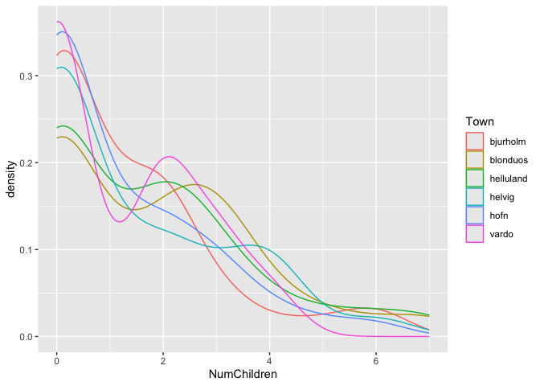<!-- -->

Looking at each town individually, in general for every town, the
densities are right-skewed, suggesting that people have a lower number
of children, with a few larger families in each town. Additionally, the
curves overlap quite a bit, suggesting that the distribution for each
town is somewhat similar. One thing to note about this plot is that it’s
looking at all the data we collected, which includes children. We can
get a more accurate distribution of the number of children an islander
has by filtering out every under the age of 18.

``` r
df |>
  filter(Age >= 18) |>
  ggplot(aes(x = NumChildren, color = Town)) +
  geom_density()
```

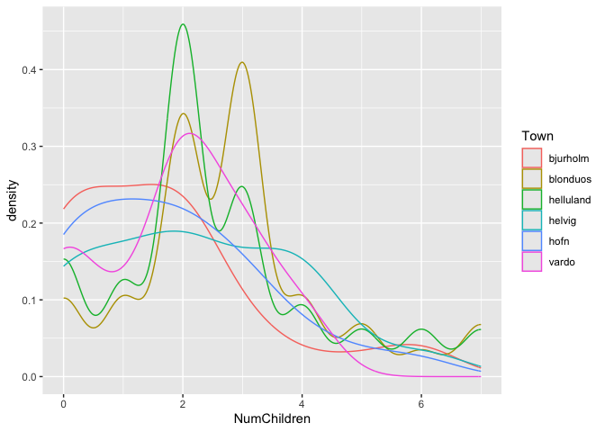<!-- -->

When we take out the children from our density plot, we get a very
different shape. Some towns appear to have multiple peaks, suggesting a
multimodal distribution, which could indicate subgroups of families
within a town. While many towns do cluster around 1-2 children, there is
meaningful variation in distribution shape. However, the density plot
may be showing multiple smaller peaks that may not be meaningful due to
the smaller sampling size.

``` r
df |>
  ggplot(aes(x = NetWorth, color = Town)) +
  geom_density()
```

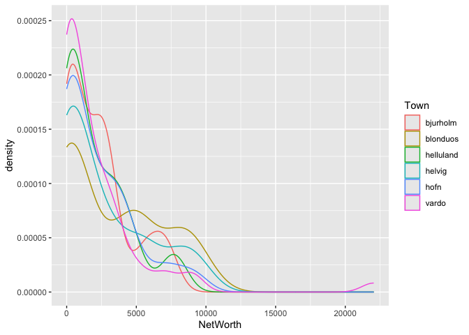<!-- -->

``` r
df |>
  filter(Age >= 18) |>
  ggplot(aes(x = NetWorth, color = Town)) +
  geom_density()
```

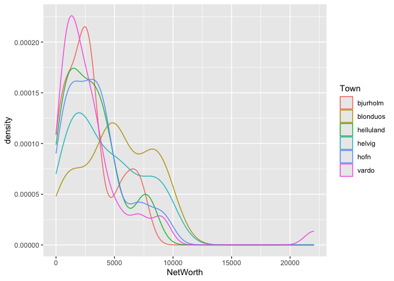<!-- -->

Continuing with our densities analysis, we can look at the spread of the
distribution of wealth on each island. All curves show a strong right
skew, meaning most values cluster toward the lower end of net worth.
Some towns have a noticeably broader spread in net worth (Blonduos,
Vardo, Helvig), potentially indicating a more diverse population in
terms of financial status.

If we look only at the adults in the dataset, we see a very similar
plot.

``` r
df |>
  ggplot(aes(x = NumHouseOccupants, color = Town)) +
  geom_density()
```

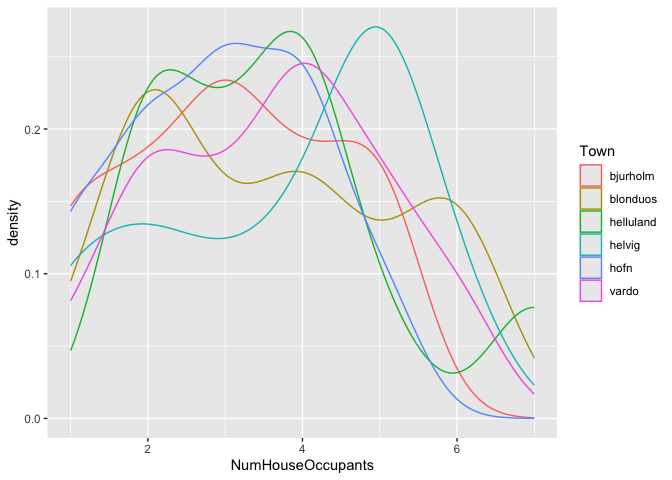<!-- -->

The next distribution we’re going to look at is the number of household
occupants. Several towns, like helluland and bjurholm appear to have
more than one distinct peak. Helvig seems to have larger household size
on average, while the other towns seem to have an average household size
of 2-4.

``` r
df |>
  ggplot(aes(x = Age, color = Town)) +
  geom_density()
```

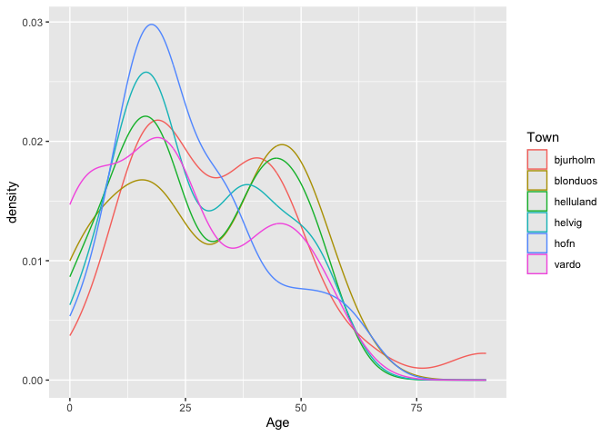<!-- -->

The final distribution we’re going to look at is age. The age range in
the data is from 0 to around 80. All of the curves show a peak around
young adult age (20 - 30) and a peak around middle age (40 - 50) or
older adulthood (60+). This indicates that there is a disproportionately
young population – perhaps there was a baby boom in Ironbard about 20
years ago.

The younger people in our dataset may bias our observations – since they
are younger they have had less time to acquire wealth or have more
children. While we make our key analyses we have to keep that in mind.

### **q3** Key Analyses

#### Net Worth by Number of Children

``` r
df |>
  ggplot(aes(x = NumChildren, y = NetWorth)) +
  geom_col() +
  facet_wrap("Town", scales = "free")
```

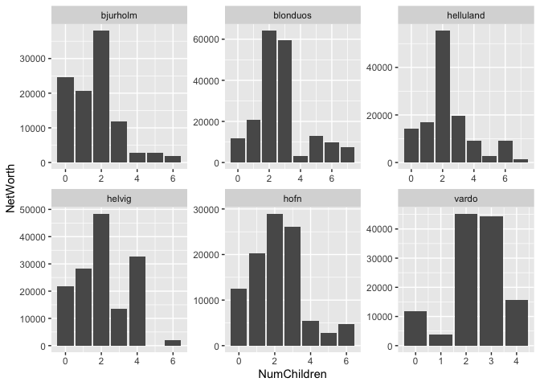<!-- -->

``` r
df |>
  ggplot(aes(x = NumChildren, y = NetWorth)) +
  geom_col()
```

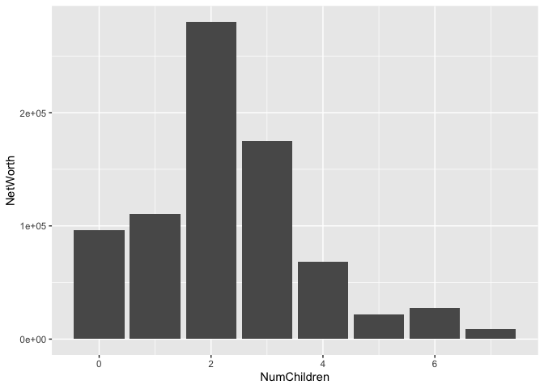<!-- -->

Here, we look at individuals net worth (log scale) and their number of
children, finding that individuals with 2 children have the highest net
worth. However, this could be a confusing finding: this is **not**
saying that on *average* individuals with 2 children have the most
money, it is saying that if you **add up** the net worth of all
individuals with 2 children, it is higher than if you did the same thing
for individuals with a different number of children.

One possible explanation of this is simply that a high number of
individuals have two children.

#### Mean Net Worth by Age Bin and Number of Children

``` r
# want to bin ages
# then find the mean networth for each unique number of children
# then find the mean number of children
df <- df |>
  mutate(age_bin = cut(
    Age, 
    breaks = seq(floor(0), ceiling(90), by = 10),
    include.lowest = TRUE, 
    right = FALSE  
  ))

summary_df <- df %>%
  group_by(age_bin, NumChildren) %>%
  summarise(mean_networth = mean(NetWorth, na.rm = TRUE), 
            .groups = 'drop')
summary_df |>
  ggplot(aes(x = age_bin, y = mean_networth, fill = factor(NumChildren))) +
  geom_bar(stat = "identity", position = "dodge") +
  labs(
    title = "Mean Networth by Age Bin and Number of Children",
    x = "Age Bin",
    y = "Mean Networth",
    fill = "Number of Children"
  ) +
  theme_minimal() +
  theme(axis.text.x = element_text(angle = 45, hjust = 1))
```

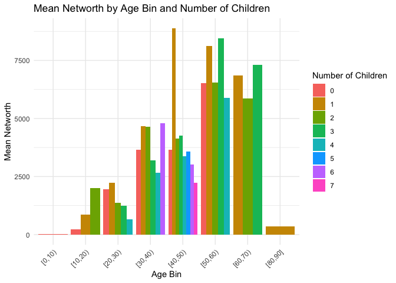<!-- -->

Here, we’re looking at three variables: age, mean net worth, and number
of children. Unlike the previous plot, this is not summative.

We can see that islanders’ net worth grows as they do, and that it
declines steeply between their 60s and 80s - possibly due to them saving
for retirement then spending their retirements.

We can also see that the number of children that islanders has a loose
correlation to their net worth, until they hit their 50s and 60s, when
the kids might move out of the house. For example, we can see a direct
inverse correlation between 20-30 year olds and number of children,
which starts to even out for 30-40 year olds. It’s back for 40-50 year
olds - are they paying for kids’ education? - and after the kids are on
their own, this evens out for 50+ year olds.

Note that this does not show an age distribution of our population: the
size of a column represents average net worth for that age bin and
number of children, not the number of people that fit it.

#### House Occupants vs. Net Worth

``` r
df |> 
  ggplot(aes(x = NumHouseOccupants, y = NetWorth)) +
  geom_col()
```

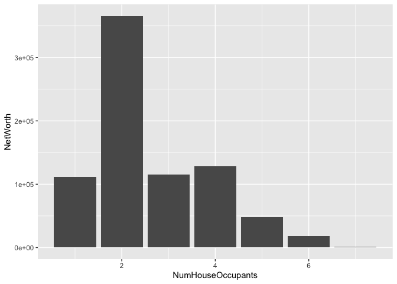<!-- -->

This plot is summative, similar to the first plot. Here, we’re looking
at the sum - not average - of net worths compared to the number of
occupants in a house.

By far, houses with 2 occupants have the most net worth, which makes
sense. This includes:

- Couples, who may both have an income

- Single parents with 1 child

We can see individual values in this plot, and we can see that, roughly,
the average of 2-person houses also has a higher average income than 4,
5, or 6 family houses, going against our hypothesis: one would think
that higher net worths would allow them to have more children, but here,
we see higher net worths in 2-person houses rather than larger ones.

#### Number of Children vs. Number of House Occupants

``` r
df |>
  ggplot(aes(x = NumChildren, y = NumHouseOccupants, fill = NumHouseOccupants)) +
  geom_col(position = "dodge")
```

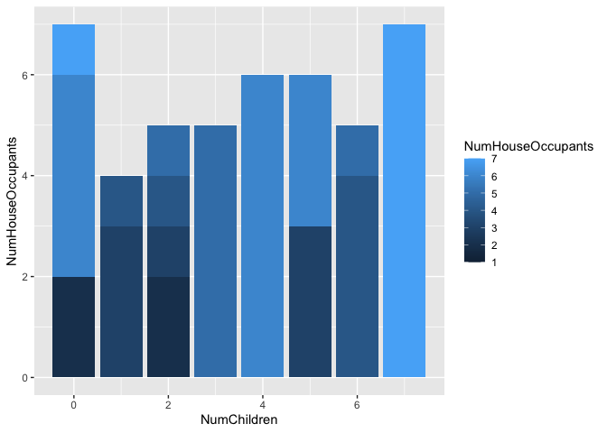<!-- -->

This plot gives us some insight into whether occupants in a house is
correlated to the number of occupants a house has. Remember that a
4-person house with two adults (parents) and two kids would be marked as
having 2 children and 4 occupants.

Let’s look at three large groups in this data:

- A high number of people with 0 children live in houses with 2 people
  inside. One could infer that many of these are couples with no kids.

- As the number of children increases, the number of house occupants
  oddly decreases. One could infer that this happens due to kids moving
  out of the house.

- A surprising number of people who have 5 children have only 2
  occupants in the house. This could mean that they’ve moved out.

#### Number of Children vs Number of House Occupants, showing Net Worth

``` r
df |>
  ggplot(aes(x = NumChildren, y = NumHouseOccupants, fill = NetWorth)) +
  geom_tile()
```

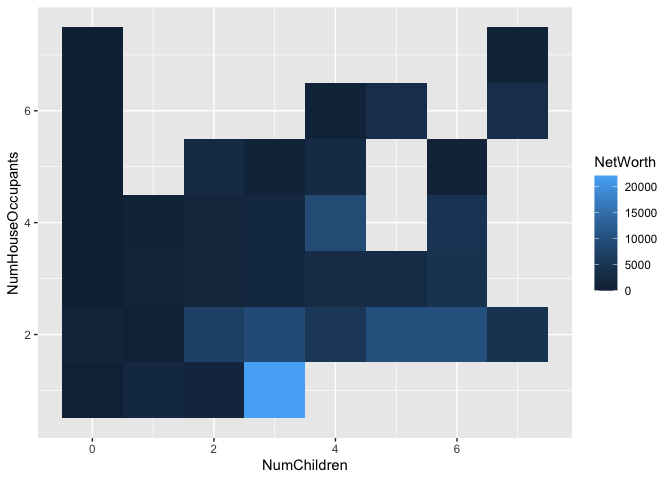<!-- -->

Finally, this chart compares all three key variables.

We can first notice the one outlier: the house with 1 occupant who had
three children and an extremely high net worth.

Looking from left to right, ignoring the number of house occupants, we
can see that the squares get lighter, meaning that net worth does have a
light correlation to the number of children someone has had. This could
be because they are older.

We also see a bright spot around 2-occupant houses with 2 kids. Those
kids may have moved out and the couples are still together.

We can also see the small sample size affect this plot: there are many
holes, especially as the number of children and number of house
occupants rise.

### **q4** Answers

From the key analyses, there is a light but present correlation between
number of children and net worth. Some islanders with more children have
higher net worths, although there is an outlier group of couples with no
kids having higher net worths.

Our sample of 20 houses from each town on the northernmost island
resulted in 322 islanders - not a huge number. While these islanders may
be representative, it could have improved our study to increase our
sample size: this would have given our averages more data to draw from,
creating a more representative sample.

We might be able to infer patterns from the islanders with more data, as
well. Another interesting study could be looking at things like
relationship length or changing our hypothesis to looking at the ages of
parents when kids were born and seeing if that correlates to net worth.
